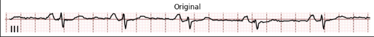
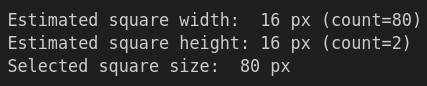
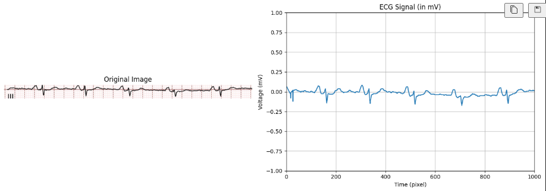
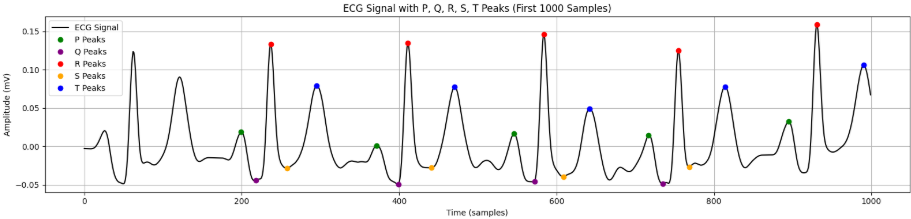
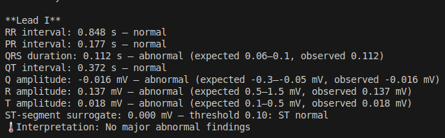
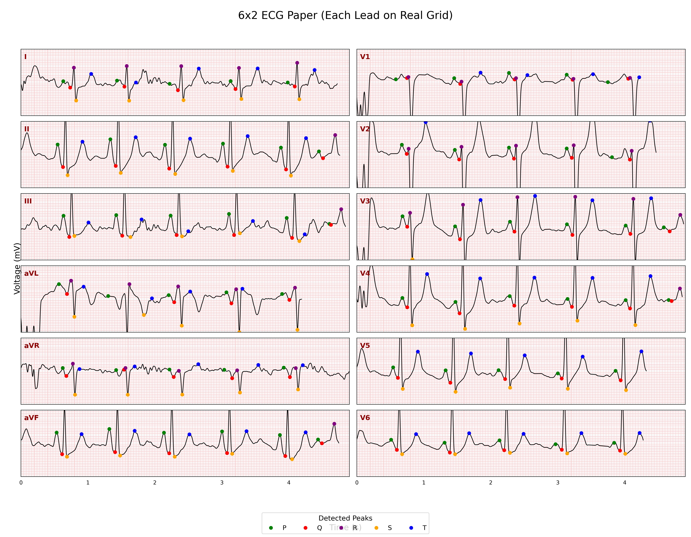

# ECG & Echocardiogram Analysis Project

## Overview

This project provides:
**Full pipeline for digitizing 12-lead ECG paper recordings** - segments leads, extracts waveforms, calibrates signals, enables PQRST detection

## Project Structure

```
project/
├── full-pipeline/             
│   ├── app.py
│   ├── main.py
│   ├── requirements.txt
│   ├── configs/
│   │   ├── lead_segmentation.yaml
│   │   ├── wave_extraction.yaml
│   │   ├── grid_detection.yaml
│   │   └── digitize.yaml
│   ├── data/
│   │   ├── inputs/
│   │   └── outputs/
│   └── scripts/
│       ├── lead_segmentation.py
│       ├── grid_detection.py
│       ├── extract_wave.py
│       ├── digitize.py
│       └── analyze_waves.py
```

## ECG Final Pipeline Methodology

### 1. Lead Segmentation (YOLO)

- Detects and crops 12 leads from input ECG image


### 2. Grid Detection & Calibration  
- Calibrates 0.2s horizontally, 0.5mV vertically

#### Sample Input

#### Detected Grid

#### Calculated Grid Size


### 3. Wave Extraction (U-Net)
- Extracts binary mask of ECG waveform


### 4. Digitization
- Converts to calibrated 1D signal



### 5. PQRS Detection & Analysis
- Detects the PQRST complex from the digitized wave


- Gives the final Analysis



### 6. ECG Paper Recreation
- Recreates the ECG paper with the pqrst complexes.
#### Sample output



## How to Run

1. **Set up environment**
   ```sh
   conda create -y -p ./venv python=3.10
   conda activate ./venv
   pip install -r requirements.txt
   ```

2. **Configure pipeline**
   - Edit YAML files in respective `configs/` directories

3. **Run pipelines**
   ```sh
   cd full-pipeline
   python3 main.py
   ```

**For implementation details, see individual module documentation.**
